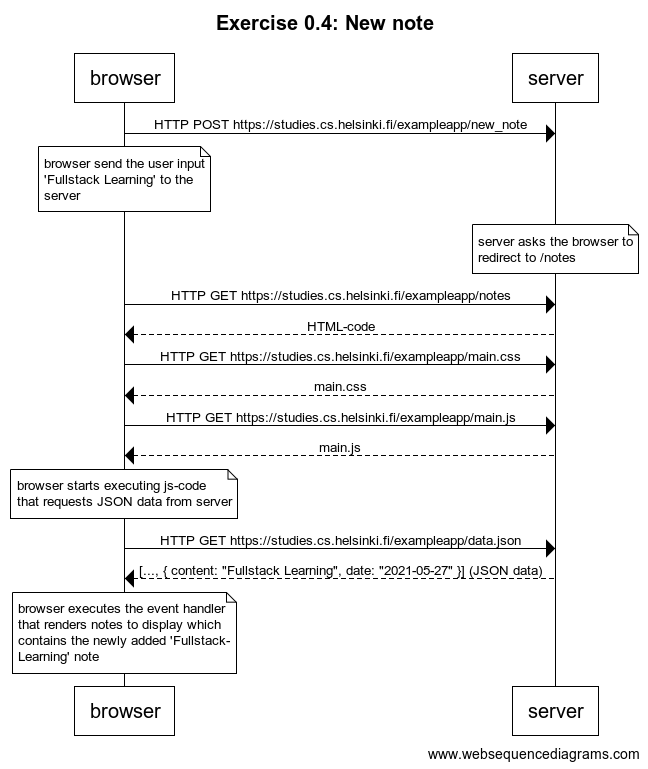
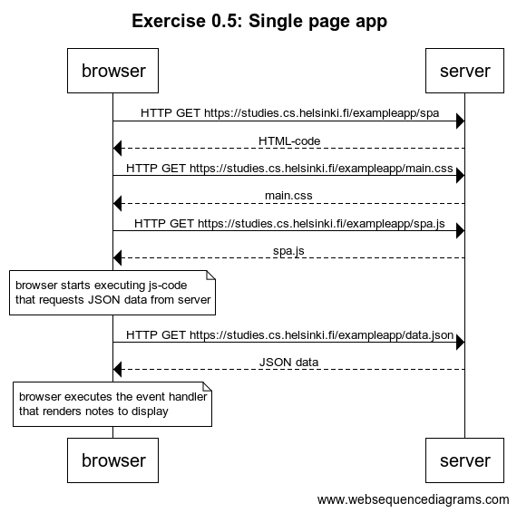
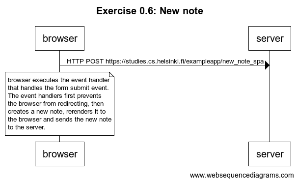

# Part 0 [Fundamentals of Web apps](https://fullstackopen.com/en/part0)

Overviews the basics of web development, and advancements in web application development over recent decades.

The exercises involve creating basic web sequence diagrams depicting network communications, as a user interacts with a web application.

## Exercise 0.4: New note

Diagram depicts communications where a user creates a new note on a [traditional web page](https://studies.cs.helsinki.fi/exampleapp/notes).

## Exercise 0.5: Single page app (spa)

Diagram depicts a situation where the user visits the single page app version of the [notes app](https://studies.cs.helsinki.fi/exampleapp/spa).

## Exercise 0.6: Single page app new note

Diagram depicts the situation where the user creates a new note using the single page version of the app.

